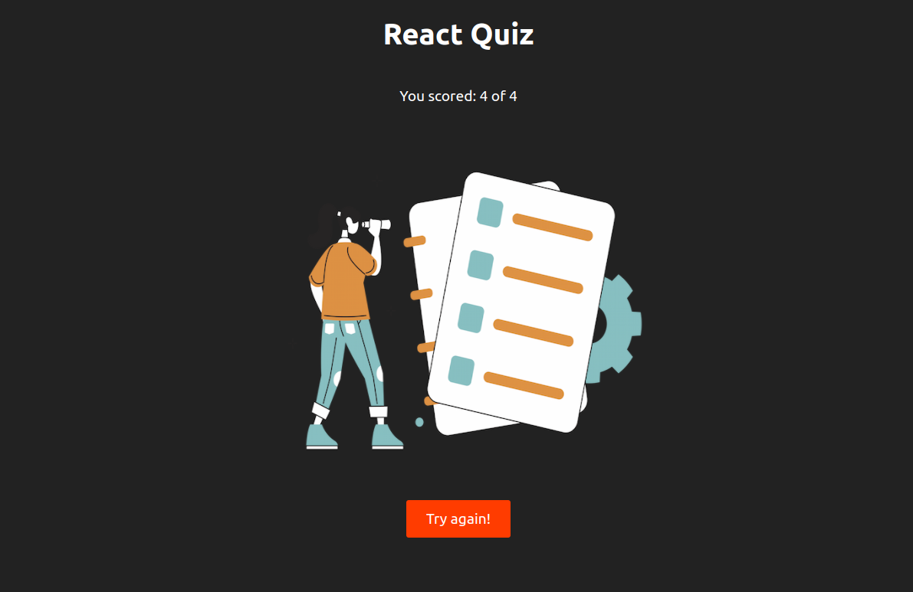

<h1 align="center">
 
    REACT QUIZ

</h1>

A short quiz so I could apply some learned concepts

## Features

Below are all features used on this project:

- **React** — Javascript library
- **CSS3** — Stylization language
- **Typescript** — Programming language

 

## Getting started

You can access the project right here: https://justareactquiz.netlify.app/

Or, if you prefer, feel free to clone and use the repository anytime.
If you don't remember how, follow this GitHub official link below in order to get the doc:
https://docs.github.com/pt/github/creating-cloning-and-archiving-repositories/cloning-a-repository-from-github/cloning-a-repository

 

## License

Free for license
